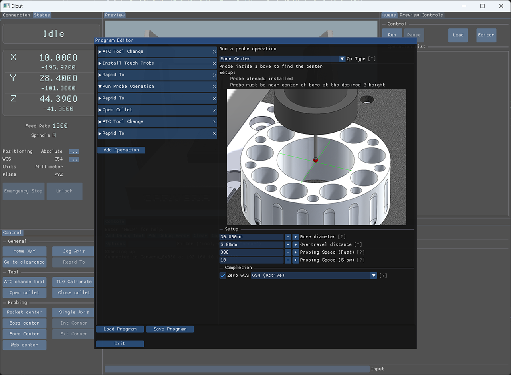

# Clout
The **C**arvera **L**ean **O**pen source **UT**ility is a custom controller for the Makera Carvera CNC mill.  Aiming to add advanced features and usability improvements over the stock controller.  This project is in very early development.  As such, use of this software is at your own risk.  There is a decent chance of a broken probe as bugs are found.



# Features
The following features are currently available:
* Home XY
* Go to clearance
* ATC tool change and TLO calibration
* Open/Close collet
* Bore & Boss center probe
* Pocket center probe
* Single axis probe (X, Y, or Z)
## Console
Commands typed in the console will be sent to Carvera. Example:
 ```bash
G38.3 X-20 F75
```

## Live 3D view
Use keyboard arrow keys to move camera.  Right click and drag mouse to look around.
 

# Installing
* Latest build can be found as an artifact of the most recent workflow run at https://github.com/AngryApostrophe/Clout/actions
* Currently available for Win x64.

# Building from source

* See https://github.com/AngryApostrophe/Clout/blob/main/build/BUILD.md

# Credits

Clout uses the following libraries:
* [Dear ImgUi](https://github.com/ocornut/imgui) - Graphical user interface
* [GLFW](https://github.com/glfw/glfw) - OS window management
* [Assimp](https://github.com/assimp/assimp) - 3D model importer
* [GLEW](https://github.com/nigels-com/glew) - OpenGL extensions
* [GLM](https://github.com/g-truc/glm) - OpenGL mathematics
* [stb](https://github.com/nothings/stb/) - Image handling
* [nlohmann/JSON](https://github.com/nlohmann/json) - JSON data handling
* [ImGuiFileDialog](https://github.com/aiekick/ImGuiFileDialog) - Gui File Dialog
